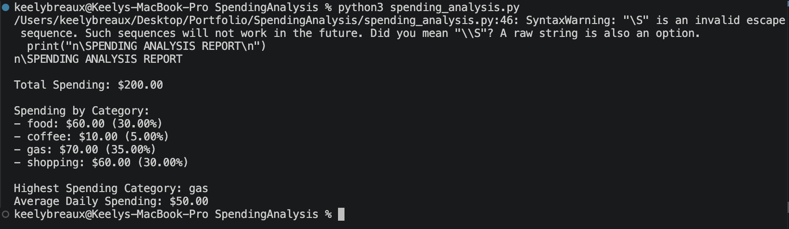

## Personal Spending Analysis (CSV-Based)

## Overview
This project is a Python-based data analysis tool that reads spending data from a CSV file and generates a summary report of financial activity. It processes structured data to calculate totals, analyze spending patterns, and provide meaningful insights. This project demonstrates working with real-world data, file handling, and basic data analysis techniques in Python.

## Features
- Reads and processes data from a CSV file<br>
- Calculates total spending<br>
- Breaks down spending by category<br>
- Identifies the highest spending category<br>
- Calculates percentage of spending per category<br>
- Computes average daily spending<br>
- Outputs a clean, formatted report in the terminal<br>

## Demo


## How to Run
1. Make sure Python 3 is installed on your computer

2. Run the program:
```bash
python3 spending_analysis.py
```

## What I Learned
- How to read and process CSV files using Python<br>
- How to work with structured data using dictionaries and lists<br>
- How to perform data aggregation (total, categories, averages)<br>
- How to calculate percentages and analyze distributions<br>
- How to break a program into reusable functions<br>
- How to generate meaningful insights from raw data

## Future Improvements
- Add support for user input instead of fixed CSV files<br>
- Visualize data using charts (matplotlib or similar libraries)<br>
- Add filtering by date range or category<br>
- Export results to a file (CSV or PDF)<br>
- Improve error handling for missing or incorrect data